# Flowcharts

A flowchart is a diagram of the steps, decisions, and repetitions in a process. Its job is to make logic visible so you can inspect it before writing any code.

Take the instruction "keep asking for the PIN until it's correct." It sounds complete, but it leaves out how many wrong attempts are allowed and what happens after that. Drawing the paths forces those questions into the open.

## Symbols

| Symbol | Used for | Example |
|--------|----------|---------|
| Start/End | Beginning or end of the process | Start, End |
| Input/Output | Reading or showing data | Read age, Display result |
| Process | A calculation or update | area = length * width |
| Decision | A true/false question | age >= 18? |
| Arrow | Direction of flow | next step |
| Connector | Joining parts of a large chart | A, B |

Every decision needs labelled branches (Yes/No or True/False). A condition inside a process box is a mistake, because a process has only one way out.

## Control flow

Picture a marker sitting at Start. It follows arrows, performs the action in each process box, and at a decision box takes only the matching branch. Not every box runs for every input. Age 20 and age 16 follow different paths through the same chart.

## Three building blocks

**Sequence.** Steps run in order. To find a rectangle's area: read length, read width, calculate `length * width`, display it. Calculating before reading would be wrong.

**Selection.** A decision picks a path. For "age at least 18," the condition `age >= 18?` sends 20 and 18 to Eligible and 17 to Not Eligible. Writing `>` instead of `>=` would wrongly reject 18.

**Iteration.** A loop repeats steps while a condition holds. To print 1 to N, a loop needs four parts:

| Part | Role | Example |
|------|------|---------|
| Initialization | Starting value | i = 1 |
| Condition | Whether to continue | i <= N? |
| Body | Repeated work | display i |
| Update | Moves toward stopping | i = i + 1 |

Without the update, the loop never ends. With `i < N`, N gets skipped. If N is 0, the first check fails and nothing prints, which is correct.

## Worked patterns

**Validate first.** For marks that must be 0 to 100, the first decision asks whether any mark is out of range. If so, show "Invalid marks" and end. Only valid data reaches the average and the pass check.

**Order matters in chained decisions.** For grades, the first true branch wins. Check `marks >= 90` before `marks >= 40`, otherwise a 95 lands in the wrong grade.

**Largest of three.** Set `largest = a`, then compare b and c against it one at a time. Starting from an actual input, not 0, keeps negative numbers working.

**Sum from 1 to N.** Set `sum = 0` and `i = 1`. Inside the loop, add `i` to `sum` and increase `i`. Display `sum` after the loop, since only the final total is wanted.

## Common mistakes

- Drawing before understanding the input, output, and rules
- Unlabelled decision branches
- Arrows that lead nowhere
- A loop with no update
- Output inside the loop when only the final result is needed
- Showing only the success path

## Before moving on

Check that every input is read before it's used, every branch is labelled, boundary values are handled, every loop can stop, and every path ends. You should be able to explain why each shape is there. If you can't, you've memorised the chart rather than understood it.

# Flowcharts

Each chart below uses the same shapes from the symbol table: rounded for Start/End, slanted for input/output, rectangles for processes, and diamonds for decisions.

## Symbols

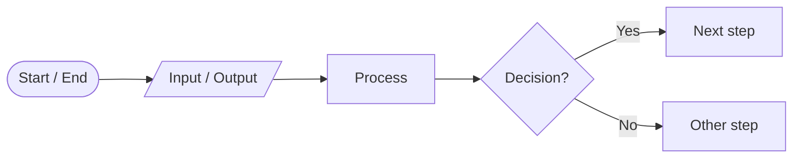

## 1. Sequence: area of a rectangle

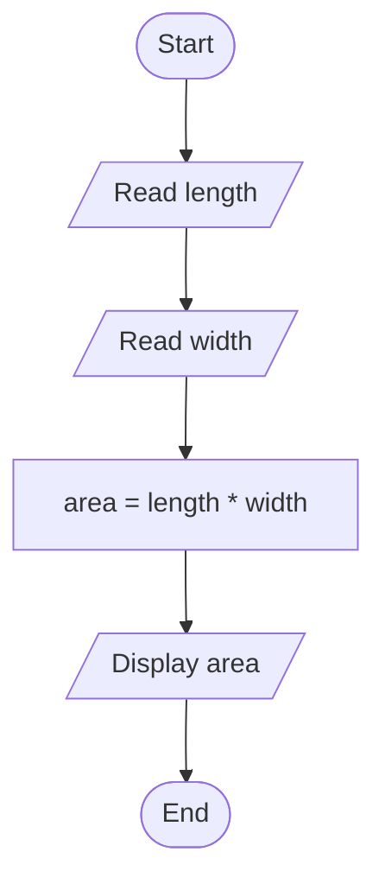

## 2. Selection: age eligibility

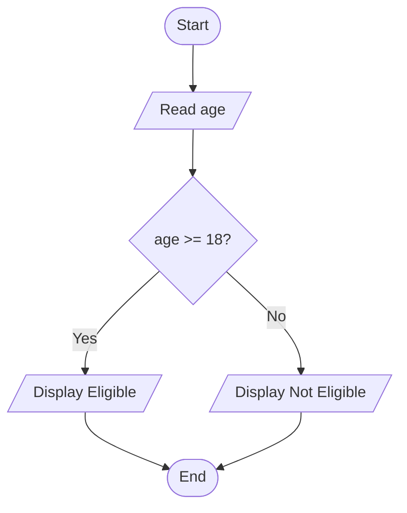

## 3. Selection with three outcomes: positive, negative, zero

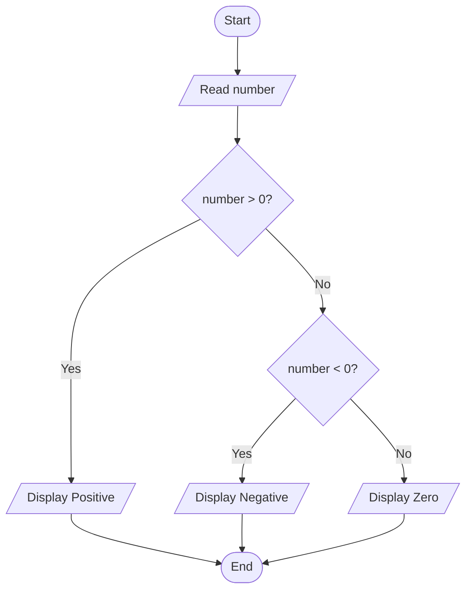

## 4. Iteration: print numbers from 1 to N

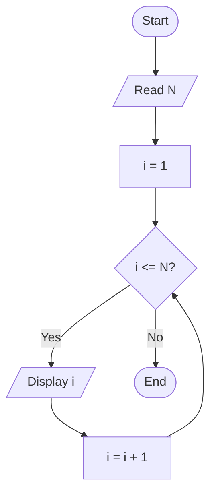

## 5. Selection inside iteration: pass or fail for N students

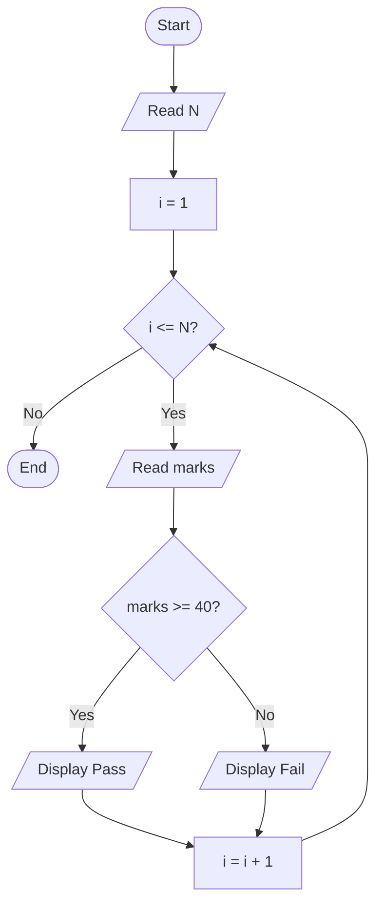

## 6. Validate first: student result

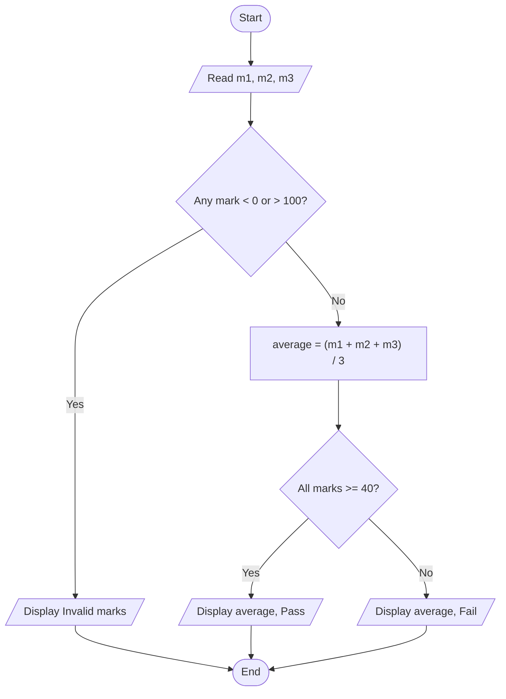

## 7. Order matters: grade classification

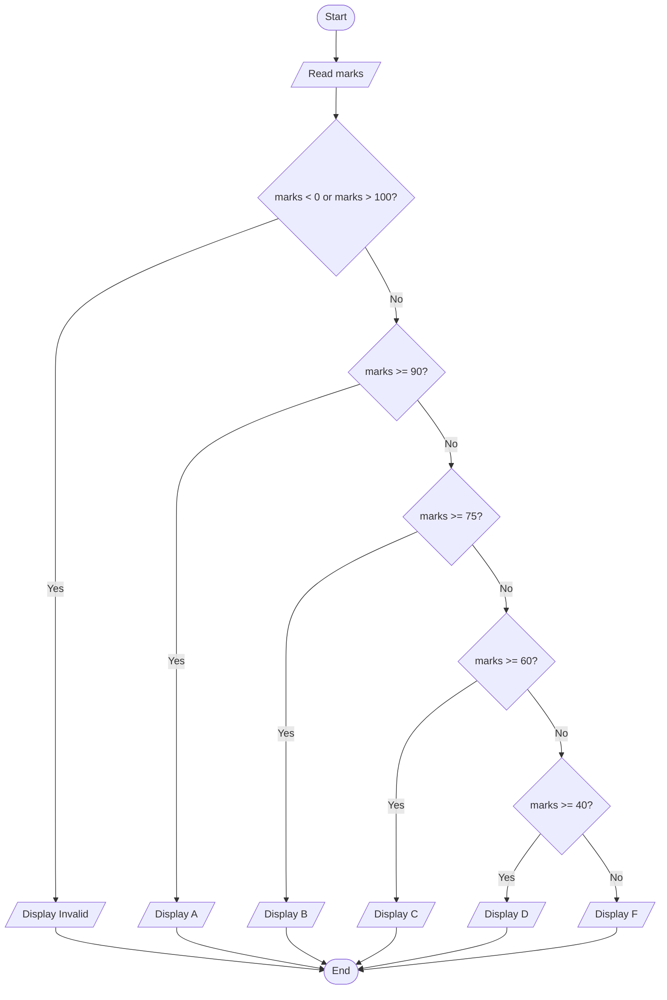

## 8. Current champion: largest of three numbers

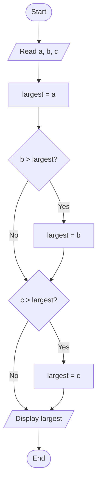

## 9. Sum from 1 to N

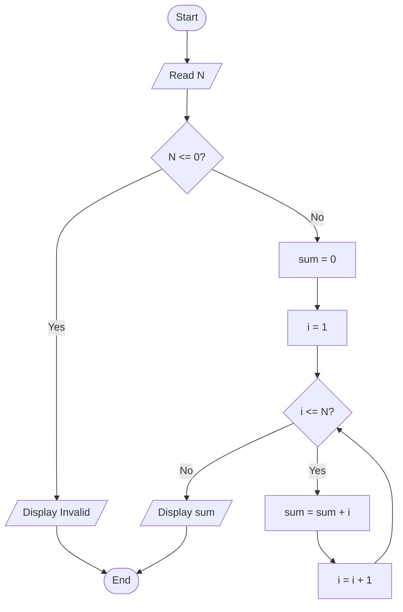

## 10. Retry with a limit: PIN check

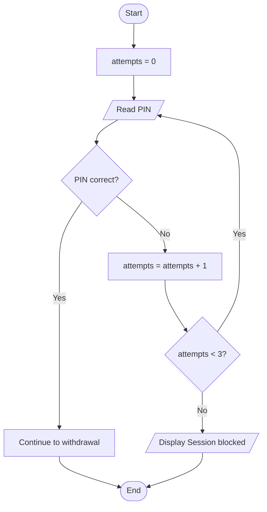

The `attempts = 0` box sits before the loop. Put it after "Read PIN" and the limit would never trigger.

## 11. ATM withdrawal

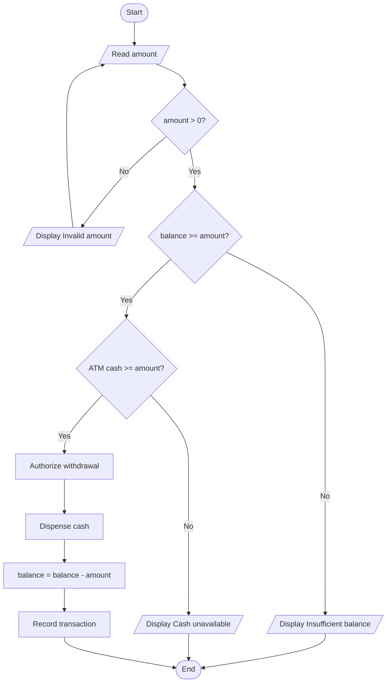

The balance is updated only after every check has passed and the cash has been dispensed.